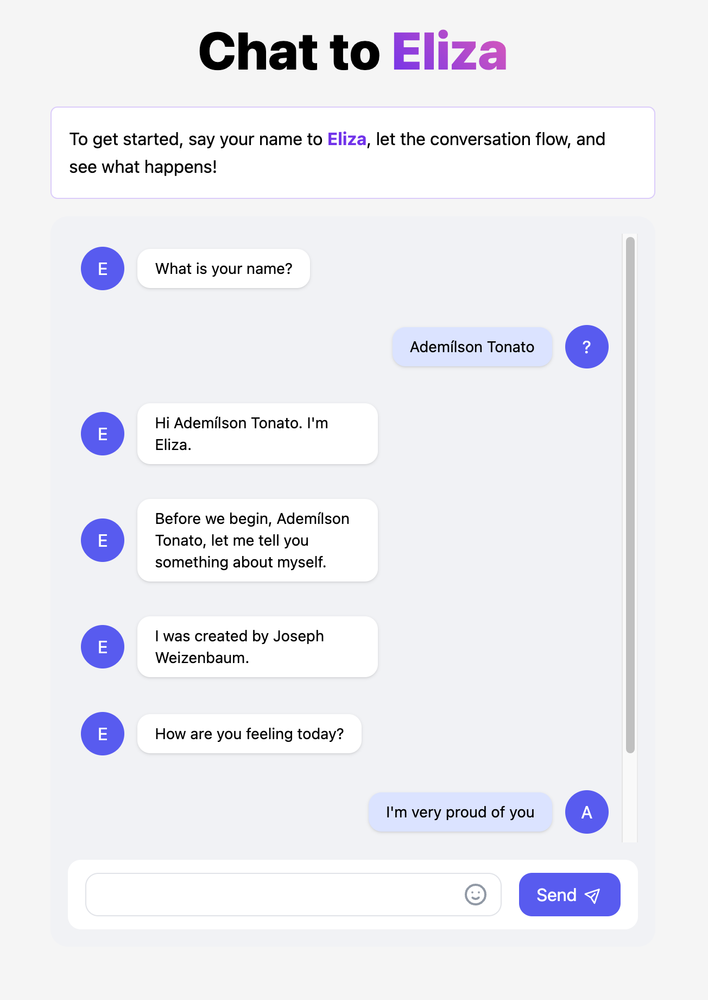

# Astro with connect-web

This project was bootstrapped as an [Astro](https://vuejs.org/) project with the command:

`npm create astro@latest -- --template basics`

We added a few dependencies to make it work with `connect-web`, check the list below:

* [Nano Stores](https://github.com/nanostores/nanostores)
* [React](https://reactjs.org/)
* [TailwindCSS](https://tailwindcss.com/)

## Getting Started

### `npm install`
### `npm start`

Runs the app in the development mode.\
Open [http://localhost:3000](http://localhost:3000) to view it in the browser.

The page will reload if you make edits.\
You will also see any lint errors in the console.

## 🧞 Commands

All commands are run from the root of the project, from a terminal:

| Command                | Action                                           |
| :--------------------- | :----------------------------------------------- |
| `npm install`          | Installs dependencies                            |
| `npm run start`        | Starts local dev server at `localhost:3000`      |
| `npm run build`        | Build your production site to `./dist/`          |
| `buf:generate`         | Use `buf` to generate the compiled protos via protobuf-es |

## 👀 Want to learn more?

Feel free to check [Astro's documentation](https://docs.astro.build) or jump into their [Discord server](https://astro.build/chat).

